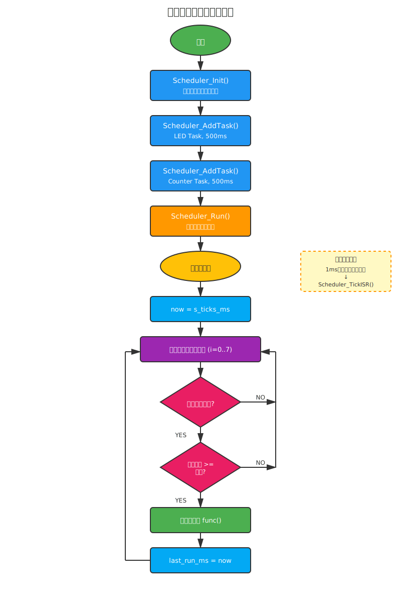
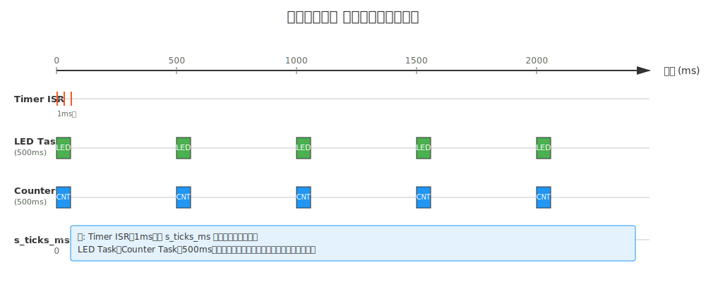

RH850/F1KM-S1　詳細設計書

# 概要
この文書は RH850/F1KM-S1 向けに作成したスタートアップ一式（アセンブリ、リンカスクリプト、システム初期化、サンプルアプリ）についての詳細設計を示す。

**目的**: ブートからアプリケーション開始までの動作を明確化し、移植・保守・レビューを支援する。

**対象デバイス**: Renesas RH850/F1KM-S1

---

**ファイル一覧**
- `src/cstartup.asm` : スタートアップ（リセットベクタ、BSSクリア、データコピー、SystemInit 呼び出し）
- `linker_script.ld`  : メモリマップとセクション割当
- `src/system_rh850.c` : システム初期化（MainOSC/PLL/クロック分周、割り込み初期化）
- `inc/system_rh850.h` : システム初期化のヘッダ
- `inc/rh850_regs.h`   : レジスタ定義（例: MOSC/PLL/INTC）
- `src/scheduler.c`   : 協調型スケジューラ実装（タスク管理、周期実行、1msタイマー連携）
- `inc/scheduler.h`   : スケジューラAPI定義
- `src/main.c`        : サンプルアプリ（スケジューラによるLED点滅とカウンタ更新）

---

**メモリマップ**
- Code Flash : 0x0000_0000 - 0x001F_FFFF (2MB)
- Data Flash : 0x0100_0000 - 0x0100_FFFF (64KB)
- RAM        : 0xFEDE_8000 - 0xFEE2_7FFF (256KB)

スタック、ヒープサイズ（リンカスクリプト）
- スタック: 8KB（`__stack_size = 0x2000`）
- ヒープ: 16KB（`__heap_size = 0x4000`）

---

**起動シーケンス（概要）**
1. ブートローダ/ROM によりリセットベクタへジャンプ（`_RESET`）
2. `cstartup.asm::_start` 実行
   - 割り込み無効化 (`di`)
   - スタックポインタ設定 (`SP_INIT` = 0xFEE28000)
   - BSS（`__sbss`〜`__ebss`）をゼロクリア
   - 初期化データ（ROM上の `__sdata_rom`）を RAM の `__sdata` へコピー (`__edata` まで)
   - `SystemInit()` を呼び出し
   - 割り込み有効化 (`ei`)
   - `main()` へ分岐
3. `main()` 実行
   - GPIO初期化（LED制御用）
   - スケジューラ初期化 (`Scheduler_Init()`)
   - タスク登録 (`Scheduler_AddTask()`)
     - LED点滅タスク（500ms周期）
     - カウンタ更新タスク（500ms周期）
   - スケジューラ開始 (`Scheduler_Run()` - 無限ループ、復帰しない)

---

**スケジューラモジュール詳細設計**

## アーキテクチャ概要
協調型（non-preemptive）スケジューラを実装。複数のタスクを周期的に実行し、1msタイマー割り込みによる時刻管理を行う。

## 主要機能
1. **タスク管理**: 最大8個のタスクを登録可能
2. **周期実行**: 各タスクに設定された周期（ms単位）で実行
3. **時刻管理**: 1msタイマー割り込みでシステムティックをカウント

## データ構造

### タスク管理構造体 (`task_t`)
```c
typedef struct {
  void (*func)(void);      // タスク関数ポインタ
  uint32_t period_ms;      // 実行周期（ミリ秒）
  uint32_t last_run_ms;    // 最終実行時刻（ミリ秒）
  uint8_t used;            // スロット使用フラグ（0: 未使用, 1: 使用中）
} task_t;
```

### 定数定義
- `MAX_TASKS`: 8（同時登録可能な最大タスク数）

### グローバル変数
- `s_tasks[MAX_TASKS]`: タスク管理テーブル（static）
- `s_ticks_ms`: システムティックカウンタ（1ms単位、volatile）

## API仕様

### `void Scheduler_Init(void)`
**目的**: スケジューラの初期化
**処理内容**:
- 全タスクスロットをクリア（未使用状態に設定）
- システムティックカウンタを0にリセット
**呼び出しタイミング**: `main()` 開始直後、タスク登録前

### `int Scheduler_AddTask(void (*task)(void), uint32_t period_ms)`
**目的**: タスクの登録
**引数**:
- `task`: 実行するタスク関数のポインタ
- `period_ms`: タスクの実行周期（ミリ秒）
**戻り値**:
- `0`: 登録成功
- `-1`: 登録失敗（空きスロットなし）
**処理内容**:
- 空きスロットを検索
- タスク情報を登録し、スロットを使用中にマーク
**呼び出しタイミング**: スケジューラ初期化後、`Scheduler_Run()` 実行前

### `void Scheduler_Run(void)`
**目的**: スケジューラメインループの開始
**処理内容**:
- 無限ループで全タスクをスキャン
- 現在時刻（`s_ticks_ms`）を取得
- 各タスクについて、前回実行時刻からの経過時間を計算
- 経過時間が周期以上の場合、タスクを実行し最終実行時刻を更新
- 1ms待機（`SystemDelay(1)`）して次のイテレーションへ
**注意**: この関数は復帰しない（無限ループ）

### `void Scheduler_TickISR(void)`
**目的**: タイマー割り込みハンドラから呼ばれる時刻更新関数
**処理内容**:
- `s_ticks_ms` をインクリメント（1ms経過）
**呼び出しタイミング**: 1msタイマー割り込みハンドラ内

## 動作シーケンス

### 初期化フロー
```
main() 開始
  ↓
Scheduler_Init() 呼び出し
  ↓ タスクテーブルクリア
  ↓ ティックカウンタ = 0
  ↓
Scheduler_AddTask(Led_Task, 500) 呼び出し
  ↓ 空きスロット検索 → スロット0に登録
  ↓
Scheduler_AddTask(Counter_Task, 500) 呼び出し
  ↓ 空きスロット検索 → スロット1に登録
  ↓
Scheduler_Run() 呼び出し
  ↓ [無限ループ開始]
```

### 実行ループフロー
```
[Scheduler_Run() メインループ]
  ↓
現在時刻 now = s_ticks_ms を取得
  ↓
for (i = 0 to MAX_TASKS-1)
  ↓
  タスク[i] が使用中？
  ↓ YES
  経過時間 = now - last_run_ms
  ↓
  経過時間 >= period_ms ？
  ↓ YES
  タスク[i].func() 実行
  ↓
  last_run_ms = now に更新
  ↓
[次のタスクへ]
  ↓
SystemDelay(1) で1ms待機
  ↓
[ループ先頭に戻る]
```

### タイマー割り込み（1ms周期）
```
[1msタイマー割り込み発生]
  ↓
Scheduler_TickISR() 呼び出し
  ↓
s_ticks_ms++
  ↓
[割り込みから復帰]
```

## メモリ使用量

### RAM使用量（静的確保）
- `s_tasks[8]`: 8 × sizeof(task_t) = 8 × 12バイト = 96バイト
  - `func`: 4バイト（関数ポインタ）
  - `period_ms`: 4バイト（uint32_t）
  - `last_run_ms`: 4バイト（uint32_t）
  - `used`: 1バイト（uint8_t、パディング込みで4バイト）
- `s_ticks_ms`: 4バイト（uint32_t）
- **合計**: 約100バイト

### スタック使用量（概算）
- `Scheduler_Run()` のローカル変数: 約16バイト
- ネストされたタスク関数呼び出し: タスク依存（通常20〜50バイト程度）
- **推奨スタックマージン**: 最低512バイト

## タイミング精度

### システムティック精度
- タイマー割り込み周期: 1ms
- オーバーフロー時間: `2^32 ms ≈ 49.7日`（実用上十分）

### タスク実行精度
- 最小実行周期: 1ms（ただし、タスク処理時間が1ms未満であることが前提）
- 実行遅延: タスク処理時間 + `SystemDelay(1)` の遅延
- ジッター: ±1ms程度（他タスクの処理時間に依存）

## 制限事項と注意点

1. **協調型スケジューリング**: タスクは自発的にCPUを譲る必要がある。長時間処理を行うタスクは他のタスクの実行を遅延させる。
2. **優先度なし**: 全タスクは同等に扱われる。緊急タスクの優先実行は不可。
3. **タスク数制限**: 最大8個まで。追加が必要な場合は `MAX_TASKS` を変更。
4. **オーバーフロー**: `s_ticks_ms` は49.7日でオーバーフローするが、差分計算により正常動作（`uint32_t` の演算特性）。
5. **再入不可**: 同一タスクが実行中に再度呼ばれることはないが、タスク関数は再入可能に実装すべき。

## 拡張・カスタマイズ方針

### タスク数の増減
`scheduler.c` の以下の定義を変更:
```c
#define MAX_TASKS   16  // 8 → 16に変更
```

### タイマー周期の変更
1msタイマー割り込みの周期を変更する場合、以下を調整:
- タイマーハードウェア設定（`system_rh850.c` 等で設定）
- `Scheduler_TickISR()` の呼び出し周期
- タスク周期の単位をドキュメントに反映

### 優先度付きスケジューリング
優先度を追加する場合:
- `task_t` 構造体に `priority` フィールドを追加
- `Scheduler_Run()` 内で優先度順にソートまたは優先実行

---

**例外ベクタ**
- `cstartup.asm` に簡易ベクタテーブルを置く（`__exception_table`）。現状はすべて `_dummy_exception` にループするダミーハンドラを割当て。
- 実運用では各ベクタに適切なハンドラを割り当て、必要に応じて優先度や割り込み設定を行うこと。

---

**BSS と Data 初期化アルゴリズム**
- BSS: `r6` を `__sbss`、`r7` を `__ebss` にしてワード単位で 0 を書き込む。ループ終了条件は `r6 >= r7`。
- Data: `r6` をソース `__sdata_rom`、`r7` をデスティネーション `__sdata`、`r8` を `__edata` にしてワードコピー。終了は `r7 >= r8`。
- アセンブリで明示的にワード (4 バイト) 単位で処理しているため、リンタやコンパイラの配置と一致させること。

---

**スタック & ヒープ**
- スタック初期アドレス: `SP_INIT = 0xFEE28000`（リンカスクリプトの RAM 範囲の上位に合わせている）
- ヒープはリンカスクリプト内で領域を確保。必要に応じてサイズを調整。

---

**SystemInit の詳細（`system_rh850.c`）**
- MainOSC を有効化（`MOSCE = 0x01`）して安定化待ち（ポーリング）
- PLL を有効化 & 安定化待ち（`PLLC0`/`PLLS0`）
- CPU クロック、ペリフェラルクロックの分周・切替（`CKSC` 系レジスタ）
- 割り込みコントローラ（EIC）を初期化して全チャネルをマスク＋最低優先度に設定
- グローバル変数 `g_system_clock`, `g_peripheral_clock` を設定

注意: レジスタ書き込みが保護されている領域の場合はプロテクション解除手順を踏む必要がある。

---

**主要レジスタとアドレス（サンプル）**
- `MOSCE` 0xFFF81100
- `MOSCS` 0xFFF81104
- `PLLC0` 0xFFF89000
- `PLLS0` 0xFFF89004
- `INTC1_BASE` 0xFFFC0000（EIC 配列）
- `PORT0` 基点 0xFFC10000

（詳細は `inc/rh850_regs.h` を参照）

---

**ビルド手順（参考/GCC クロスツールチェーン）**
```powershell
# アセンブル
rh850-elf-as -mcpu=g3m -o cstartup.o src/cstartup.asm
# コンパイル
rh850-elf-gcc -mcpu=g3m -O2 -I inc -c src/system_rh850.c -o system_rh850.o
rh850-elf-gcc -mcpu=g3m -O2 -I inc -c src/main.c -o main.o
# リンク
rh850-elf-ld -T linker_script.ld cstartup.o system_rh850.o main.o -o firmware.elf
# HEX 生成
rh850-elf-objcopy -O ihex firmware.elf firmware.hex
```

---

**検証/デバッグ手順**
- JTAG/デバッガで RAM と ROM に正しいイメージを書き込み、リセット後に `main` に到達するか確認
- BSS セクション開始アドレスと終了アドレスが正しいか確認（未初期化変数が 0 になるか）
- Data コピー元アドレス (`__sdata_rom`) がリンカで期待した ROM 上の位置になっているかを検証
- クロック設定後に `SystemGetCpuClock()` の返り値が期待値か確認

---

**カスタマイズ方法**
- スタックサイズ変更: `linker_script.ld` の `__stack_size` を更新
- クロック設定変更: `system_rh850.c` の `PLL_MUL`, `CPU_DIV`, `PERIPHERAL_DIV` を更新し、`SystemClockInit()` 内の設定を調整
- ベクタテーブル拡張: `cstartup.asm` の `__exception_table` に各ハンドララベルを追加

---

**注意点**
- レジスタアドレスは設計参照からコピーしたサンプル値。実際のリビジョン・ボードに合わせて確認が必要
- 実機テスト時はウォッチドッグや保護レジスタに注意すること
- 複数 `.ino` のような自動結合されるソースファイル配置に注意（Arduino 特有のルールは本プロジェクトには該当しないが、ファイル配置ポリシーを守ること）

---

**変更履歴**
- 2025-11-16 : 初版作成（スタートアップアセンブリ、リンカスクリプト、system init、サンプル main を反映）
- 2025-11-17 : スケジューラモジュール追加（協調型スケジューラ、タスク管理、1msタイマー連携の詳細設計を追加）


<!-- End of Detailed Design -->
---

## フローチャート

以下は起動シーケンスのフローチャートです。ブートからアプリケーション開始（main()）までの主要ステップを図示しています。


簡単な説明:
- リセットベクタから `_start` に入り、割り込みを無効化してスタックを初期化します。
- BSS をゼロクリアし、ROM 上の初期化データを RAM にコピーします。
- `SystemInit()` を実行してクロック等の初期化を行い、割り込みを有効化して `main()` に移行します。

### システムアーキテクチャ図


システムは以下の5層で構成されています：
1. **スタートアップ層**: cstartup.asm、linker_script.ld によるブート処理
2. **ハードウェア層**: RH850 CPU、タイマー、GPIO、周辺機器、メモリ
3. **HAL/ドライバ層**: system_rh850.c、レジスタ定義、ドライバ関数
4. **OS/ミドルウェア層**: scheduler.c による協調型スケジューラ（将来的な拡張領域含む）
5. **アプリケーション層**: main.c とユーザー定義タスク（LED、Counter等）

### スケジューラフローチャート



スケジューラの動作フロー：
- 初期化時にタスクテーブルをクリアし、複数のタスクを登録
- メインループで全タスクをスキャンし、周期が経過したタスクを実行
- 1msタイマー割り込みで時刻カウンタ（s_ticks_ms）を更新

### スケジューラタイミングチャート



タイミング図の説明：
- Timer ISRは1ms毎に s_ticks_ms をインクリメント
- LED TaskとCounter Taskは500ms周期で実行
- 両タスクのタイミングは同期（同じ周期、同じ開始時刻）

### 詳細フロー図

1) 起動メインフロー（細分化）：


2) `SystemInit()` 詳細フロー：


上記図は `SystemInit()` の内部ステップ（MainOSC の起動、PLL 設定、分周器の切替、割り込みコントローラ初期化など）を順序立てて表現しています。

### フェイル時の分岐（追加）

起動・初期化処理で発生し得る失敗ケースを想定した分岐図を追加しました。

- **MainOSC が安定しない場合**: 内部 RC にフォールバックするか、所定回数再試行します。再試行後も失敗する場合はセーフモード（エラーLED点灯やホストからの更新待ち）に遷移します。
- **PLL ロック失敗**: 再試行や低速クロックへのフォールバックを検討し、復旧不能なら安全に停止またはセーフクロックで継続します。
- **データコピー／CRC 検証失敗**: イメージ破損の可能性があるためブートローダに戻してリカバリを試行します。
- **ウォッチドッグ関連**: 初期化中にウォッチドッグがタイムアウトしないようにリフレッシュまたは一時停止処理が必要です（実装依存）。

図面:


